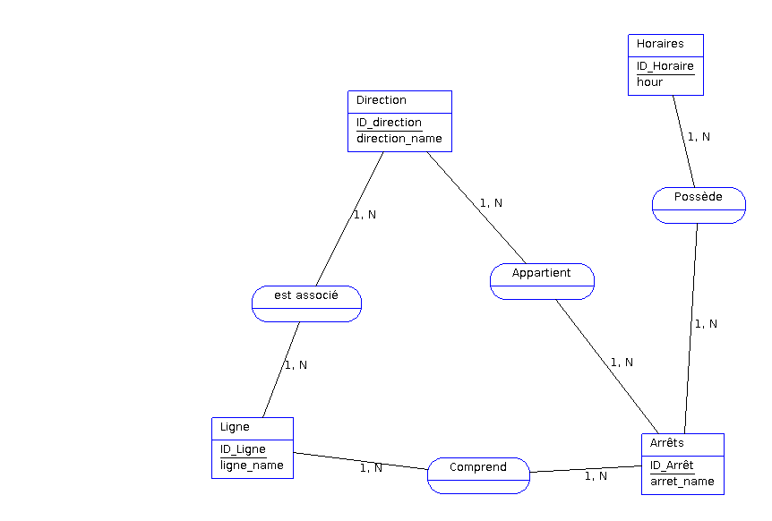

# Table des matières

1. [Installation et Utilisation](#installation)
2. [Conception](#conception)
3. [Référence](#référence)

# Installation et utilisation
Avant de démarrer, assurez-vous d'avoir bien installé mysql sur votre machine et d'avoir initialisé une clé ssh sur votre compte github...

## 1. Clonage du projet

Sur votre machine, cloner le repository dans le répertoire de votre choix :

```bash
git clone git@github.com:TristeTempsChang/eval-sql.git
```

## 2. Allez dans le dossier du projet et ouvrez Visual studio code dedans :

```bash
cd eval-sql
```

```bash
code .
```

## 3. Retournez sur le terminal et ouvrez le terminal mysql avec la commande : 

```bash
sudo mysql -u "nom de votre utilisateur" -p
```

## 4. Créez la database et allez dessus : 

```bash
CREATE DATABASE evalsql;
```

```bash
use evalsql;
```

## 5. Retournez sur visual studio, faite un clic droit sur le fichier schema.sql, sélectionnez "Copy path" puis retournez sur le terminal et effectuez cette commande : 

```bash
source "Collez le path que vous avez copié dans VsCode"
```

## 6. Effectuez la même étape mais pour le fichier data.sql 

```bash
source "Collez le path que vous avez copié dans VsCode"
```

## 6. Effectuez la même étape mais pour le fichier queries.sql et admirez le résultat !

```bash
source "Collez le path que vous avez copié dans VsCode"
```


## Conception <a name="conception"></a>
MCD réalisé avec AnalyseSI :



Dictionnaire des données en markdown :

```bash
| Libellé             | Code                | Type   | Longueur | Obligatoire | Règle de calcul | Contrainte d'intégrité | Commentaire                       |
|---------------------|---------------------|--------|----------|-------------|-----------------|------------------------|-----------------------------------|
| ID_Arret            | ID_Arret            | N      |          | Oui         |                 | PRIMARY KEY            | Identifiant unique de l'arrêt    |
| arret_name          | arret_name          | AN     | 200      | Non         |                 |                        | Nom de l'arrêt                  |
| ID_Ligne            | ID_Ligne            | N      |          | Oui         |                 | PRIMARY KEY            | Identifiant unique de la ligne   |
| ligne_name          | ligne_name          | AN     | 64       | Non         |                 |                        | Nom de la ligne                 |
| ID_direction        | ID_direction        | N      |          | Oui         |                 | PRIMARY KEY            | Identifiant unique de la direction |
| direction_name      | direction_name      | AN     | 64       | Non         |                 |                        | Nom de la direction             |
| ID_Horaire          | ID_Horaire          | N      |          | Oui         |                 | PRIMARY KEY            | Identifiant unique de l'horaire |
| hour_Horaires       | hour_Horaires       | D      |          | Non         |                 |                        | Heure des horaires             |
| order_in_direction  | order_in_direction  | N      |          | Oui         |                 |                        | Ordre dans la direction         |

```

## Référence
- https://sql.sh/
- https://stackoverflow.com/
- https://chat.openai.com/
- https://www.youtube.com/
- Mes collègues de travail
